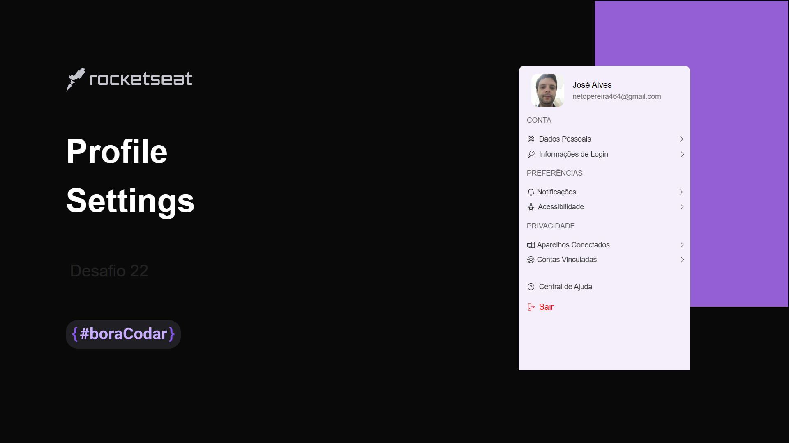

# Profile-Settings

# Como testar?

Você pode fazer um clone do projeto e abrir de preferência no Visual Studio Code

Inicializar o projeto com npm install 

Para inicializar o typescript execute npx tsc

Para Tailwind css você precisará executar os seguintes comandos:

npm install -D tailwindcss 
npx tailwindcss init 
